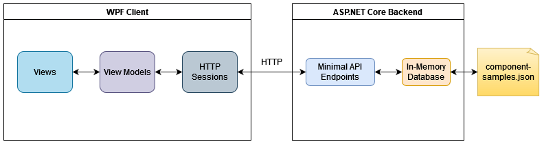
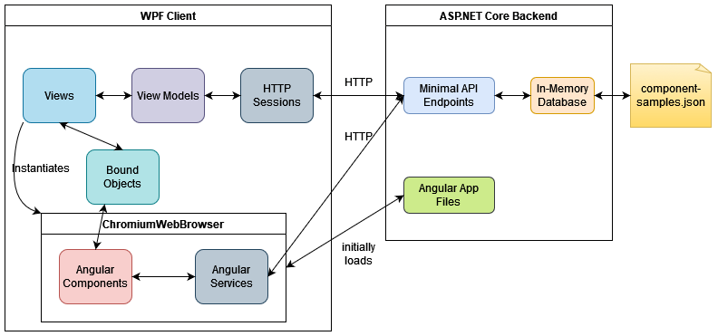
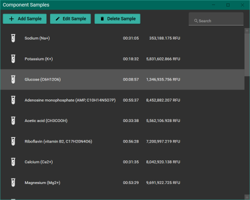
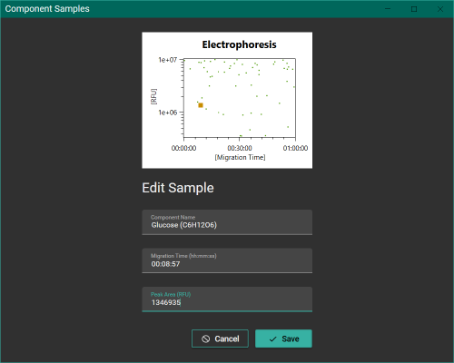
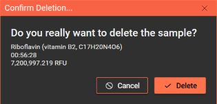
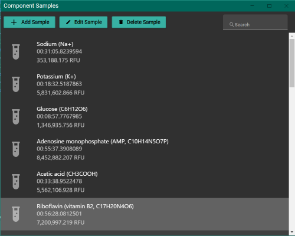
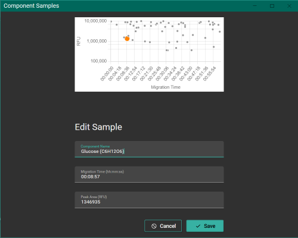
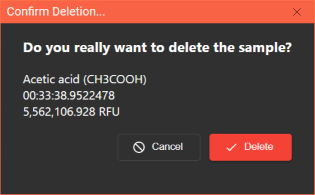

# WPF to Angular - Proof-of-Concept

*This proof of concept shows you how a WPF app can be gradually transformed to an Angular app.*

Goals:
- Demonstrate seamless use of web based components inside a WPF application for users
- Open up a path for a step by step reduction of WPF components for the project which could lead to a complete web based solution to meet future needs for the product without beeing forced into a "big bang"-strategy
- Discribe architectural requirements and show how they are used

## TL;DR;

This repo contains a `main` and the `angular-app` branch.

The former represents a classical WPF-solution-architecture:


The latter the architecture enabling the use of web based components:


> Not adressed: 100% web based solution using of (e.g.) [Electron](https://www.electronjs.org/) or [Progressive](https://developer.mozilla.org/en-US/docs/Web/Progressive_web_apps) / [Isolated](https://chromestatus.com/feature/5146307550248960) Web App approach.

## Architecture and Design

 This example is a distributed app with a desktop app and an HTTP service which offer basic CRUD operations for component samples. We have a list view with infinite scrolling that displays all samples and allows searching, a form where a single component sample can be created or edited, and a dialog where users have to confirm the deletion of a sample. A single component sample consists of the following properties:

- Id (Guid)
- Component Name (string)
- Migration Time (TimeSpan)
- Peak Area (decimal)

In the upcoming sections, we will discuss how the default architecture looks like on the main branch and how the architecture was changed to replace some parts of a view or even complete views with Angular.

### Default Architecture on the main branch

This example contains two processes, an ASP.NET Core backend and a WPF client.

The backend offers Minimal API endpoints that implement the different CRUD operations. While a unit-of-work pattern is used in these endpoints, the actual data access layer only consists of an in-memory context which loads a JSON file (if available) at service startup and saves the changes back to the file when the service is shut down. Demo data is automatically generated when no JSON file is available at startup.


The WPF client is implemented using the popular Model-View-ViewModel (MVVM) pattern. Views are defined in XAML as User Controls, View Models derive from a `BaseNotifyPropertyChanged` or `BaseNotifyDataErrorInfo` class to support observability via `INotifyPropertyChanged` and error handling via `INotifyDataErrorInfo`. HTTP requests are performed via humble objects called sessions: they provide a simple abstraction over the .NET `HttpClient` and perform I/O with the backend service.

The app contains three different views: a list view that shows all component samples and allows searching,...



...a form view that allows editing a single component sample (this view also renders a scatter chart of all samples, the edited sample is shown in orange),...



...and a modal confirmation dialog that is shown when the user wants to delete a sample.



The WPF Client uses [Material Design in XAML](https://github.com/MaterialDesignInXAML/MaterialDesignInXamlToolkit) for reusable components and styling, [MahApps.Metro](https://github.com/MahApps/MahApps.Metro) for the Window styling, and [OxyPlot](https://github.com/oxyplot/oxyplot) for chart rendering. Navigation is performed with an app shell, the `MainWindowViewModel` holds a reference to the currently visible view. When navigation is performed, the new view is instantiated by a navigation command, the corresponding view models are resolved via a DI container (Microsoft.Extensions.DependencyInjection). The navigation commands do not call into the DI container, but use .NET delegates as abstractions to avoid the Service Locator anti-pattern.

This describes the default architecture, let's have look how things change when we introduce an angular app that replaces parts of the WPF views or even entire WPF views.

### With Angular app on the angular-app branch

Please switch to the `angular-app` branch to investigate the changes:

```cmd
git checkout angular-app
```

To introduce a web frontend to a WPF client, this examples uses the Chromium Embedded Framework (CEF). This is a variant of the Chromium browser that can be easily embedded in other applications. [CefSharp](https://github.com/cefsharp/CefSharp), which is used in this sample app, is a popular .NET framework that allows you to easily integrate CEF into your .NET apps.


CefSharp offers you the ChromiumWebBrowser WPF control that you can place anywhere in your layout where you want Chromium to render a web frontend. The `ChromiumWebBrowser` has an `Address` property where you can specify a URL to download the initial HTML, CSS, and JS files. In this branch, the ASP.NET Core backend simply hosts these files, too, via the [Microsoft.AspNetCore.SpaServices.Extensions](https://www.nuget.org/packages/Microsoft.AspNetCore.SpaServices.Extensions) package.

After the initial load, the Angular app is running. To communicate bidirectionally between the JavaScript (JS) environment and the WPF host, so-called Bound Objects must be established by the WPF app, usually one per view. The Angular components in this example are written in a way that they first check if the CefSharp host is present before communicating, so that they can also run independently in any browser (this is beneficial for development).

The Angular app itself is implemented according to the common patterns: services are used to communicate with backends (they serve exactly the same purpose as the HTTP sessions on the WPF side). Additionally, [Angular Material](https://material.angular.io/) is used for styling and [ng2-charts](https://github.com/valor-software/ng2-charts) is used to render the chart.

Let's have a look at the different views where Angular is used:



In this list view, the toolbar is still rendered with WPF, but the list itself is rendered via Angular. This example shows bi-directional communication between WPF host and Angular app, the component samples that are displayed are fetched from the ASP.NET Core backend by the Angular app.



In the form view, the chart is now rendered with Angular. This example demonstrates how DTOs can be exchanged between WPF host and Angular app.



Finally, we have the delete dialog, which is now completely rendered in Angular. It shows how the Angular app performs HTTP calls to the backend and afterwards instructs the WPF host to navigate (close the Dialog window).

## How to build and run the example

### Prerequisites

To run this example, you need the [.NET 7 SDK](https://dotnet.microsoft.com/en-us/download/dotnet/7.0) as well as [NodeJS](https://nodejs.org/en) installed on your Windows computer. The .NET SDK is usually installed when you have an up-to-date version of Visual Studio.

### ASP.NET Core Backend

The easiest way to run the ASP.NET Core backend is to execute the `run-backend.cmd` file in a terminal of your choice on a Windows machine. This script builds the ASP.NET Core service, builds the Angular app (if available) and copies the resulting bundle over to the ASP.NET Core service, and then starts the service. You can terminate the service by simply pressing `CTRL+C` in your terminal. The backend is hosted on `http://localhost:5000`.

You can also debug the backend using an IDE of your choice. Keep in mind that you need to build the Angular app with `ng build --configuration production` and copy over the `./angular-app/dist/angular-app` folder into the `./Backend/bin/Debug/net7.0` folder when you are on the angular-app branch.

### WPF app

Similarly to the backend, you can simply execute the `run-wpf-app.cmd` in a terminal on a Windows machine. Please keep in mind that the backend must be running so that the WPF app can perform HTTP requests against it.